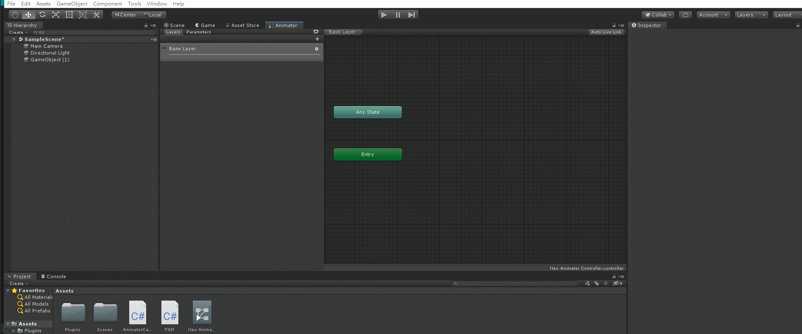

# UnityTool_AnimatorCallBackControll
一個簡單的功能 可以讓Animator裡面的StateMachineBehaviour可以在Inspector裡做CallBack

A simple function, that you can do callback  StateMachineBehaviour  in the Inspector.

### Demo

